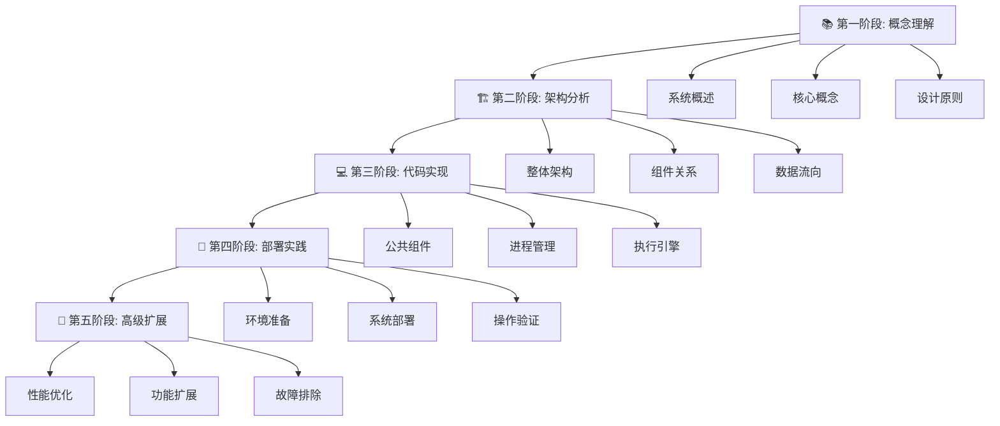

# 🎓 Multi-VM 区块链执行系统 - 完整学习指南

## 📋 学习目标

通过本指南，您将能够：
- 🧠 **理解系统架构**：掌握多区块链执行的核心概念
- ⚙️ **掌握实现细节**：了解各组件的工作原理和交互方式
- 🛠️ **实践操作技能**：能够部署、管理和扩展系统
- 🔧 **开发和定制**：具备修改和扩展系统的能力

---

## 🗺️ 学习路径图



---

## 📚 第一阶段: 概念理解 (预计学习时间: 2-3小时)

### 🎯 学习目标
- 理解多区块链执行系统的基本概念
- 掌握P2P隔离和共识禁用的原理
- 了解项目的应用场景和价值

### 📖 必读文档
1. **[项目README](../README.md)** - 项目概述和快速开始
2. **[最终状态报告](FINAL_STATUS_REPORT.md)** - 完整的项目成就
3. **[架构设计](ARCHITECTURE.md)** - 系统设计原理

### 🧠 核心概念

#### 1.1 什么是多区块链执行系统？
多区块链执行系统是一个能够同时管理多个区块链执行引擎的基础设施，它：
- 🔒 **隔离网络**: 完全禁用P2P和共识，创建纯执行环境
- 🎯 **外部控制**: 通过标准API接受外部区块提交
- ⚡ **高效执行**: 专注于交易执行和状态管理
- 🛡️ **故障隔离**: 每个区块链独立运行，互不影响

#### 1.2 为什么需要P2P和共识禁用？
```
传统区块链节点 vs 执行专用节点

┌─────────────────────┐    ┌─────────────────────┐
│   传统完整节点       │    │   执行专用节点       │
├─────────────────────┤    ├─────────────────────┤
│ ✓ P2P 网络通信      │    │ ✗ P2P 完全禁用      │
│ ✓ 共识算法参与      │    │ ✗ 共识完全禁用      │
│ ✓ 区块生产/验证     │    │ ✓ 区块执行专用      │
│ ✓ 交易池管理        │    │ ✗ 交易池禁用        │
│ ✓ 状态管理          │    │ ✓ 状态管理          │
└─────────────────────┘    └─────────────────────┘
```

**优势:**
- 🎯 **专注执行**: 无网络开销，纯计算环境
- 🔐 **安全隔离**: 无外部连接，减少攻击面
- ⚡ **高性能**: 无共识延迟，即时执行
- 🛠️ **易测试**: 确定性环境，便于开发测试

#### 1.3 应用场景
- **🧪 开发测试**: 快速的区块链应用开发环境
- **🔬 研究实验**: 区块链算法和协议研究
- **🏗️ 基础设施**: 作为更大系统的执行层
- **📚 教育培训**: 区块链技术学习和演示

### ✍️ 第一阶段练习

#### 练习1.1: 概念理解检查
回答以下问题：
1. 什么是执行专用节点？它与完整节点有什么区别？
2. 为什么要禁用P2P和共识？
3. 这个系统适合哪些应用场景？

#### 练习1.2: 文档阅读
1. 阅读 [项目README](../README.md) 的前半部分
2. 查看 [最终状态报告](FINAL_STATUS_REPORT.md) 的项目概述
3. 理解系统的核心特性和优势

---

## 🏗️ 第二阶段: 架构分析 (预计学习时间: 3-4小时)

### 🎯 学习目标
- 深入理解系统的整体架构
- 掌握各组件的职责和交互方式
- 了解数据流向和控制流程

### 📊 系统架构深度解析

#### 2.1 整体架构图
```
外部区块提供者 (Block Providers)
         │
         ▼
┌─────────────────────────────────────────────────────────┐
│               Multi-VM Process Manager                  │
│ ┌─────────────┐ ┌─────────────┐ ┌─────────────────────┐ │
│ │ Block Router│ │Health Monitor│ │ Resource Monitor    │ │
│ └─────────────┘ └─────────────┘ └─────────────────────┘ │
│ ┌─────────────┐ ┌─────────────┐ ┌─────────────────────┐ │
│ │ IPC Transport│ │Process Mgmt │ │ Recovery Manager    │ │
│ └─────────────┘ └─────────────┘ └─────────────────────┘ │
└─────────────────────────────────────────────────────────┘
         │                              │
         ▼                              ▼
┌─────────────────────┐        ┌─────────────────────┐
│   Reth 执行引擎      │        │  Solana 执行引擎     │
│ ┌─────────────────┐ │        │ ┌─────────────────┐ │
│ │  reth process   │ │        │ │solana-validator │ │
│ │ (P2P disabled)  │ │        │ │ (P2P disabled)  │ │
│ │(Consensus off)  │ │        │ │(Consensus off)  │ │
│ └─────────────────┘ │        │ └─────────────────┘ │
│ ┌─────────────────┐ │        │ ┌─────────────────┐ │
│ │   Engine API    │ │        │ │   JSON-RPC      │ │
│ │  (JWT Auth)     │ │        │ │  (HTTP/WebSocket) │ │
│ └─────────────────┘ │        │ └─────────────────┘ │
└─────────────────────┘        └─────────────────────┘
         │                              │
         ▼                              ▼
┌─────────────────────┐        ┌─────────────────────┐
│     Reth Data       │        │   Solana Ledger     │
│   (Blockchain DB)   │        │   (RocksDB/SQLite)  │
└─────────────────────┘        └─────────────────────┘
```

#### 2.2 组件职责详解

##### 🧠 Process Manager (核心大脑)
```rust
// 位置: multivm-process-manager/src/manager.rs
pub struct MultivmProcessManager {
    config: MultivmConfig,
    engines: HashMap<ProcessId, Box<dyn ExecutionEngine>>,
    block_router: BlockRouter,
    health_monitor: HealthMonitor,
    resource_monitor: ResourceMonitor,
    ipc_transport: IpcTransport,
}
```

**主要职责:**
- 🎯 **进程协调**: 管理多个执行引擎的生命周期
- 🔄 **区块路由**: 根据区块链类型分发区块
- 🏥 **健康监控**: 实时监控各组件健康状态
- 📊 **资源管理**: 监控和限制资源使用
- 🔗 **IPC通信**: 进程间通信管理

##### ⚡ Reth 执行引擎
```rust
// 位置: reth-execution-engine/src/engine.rs
pub struct RethExecutionEngine {
    process: Option<Process>,
    config: EthereumConfig,
    data_dir: PathBuf,
    jwt_secret: String,
}
```

**配置要点:**
```bash
# P2P 完全禁用
--no-discovery           # 禁用节点发现
--port 0                 # 禁用P2P端口
--max-outbound-peers 0   # 无出站连接
--max-inbound-peers 0    # 无入站连接

# 共识禁用
--dev                    # 开发模式
--dev.block-time 0       # 不自动出块
--no-txpool             # 禁用交易池

# 执行专用
--http --http.port 8545  # HTTP RPC
--authrpc.port 8546      # Engine API
```

##### 🌐 Solana 执行引擎
```rust
// 位置: solana-execution-engine/src/engine.rs
pub struct SolanaExecutionEngine {
    process: Option<Process>,
    config: SolanaConfig,
    ledger_path: PathBuf,
    genesis_config: GenesisConfig,
}
```

**配置要点:**
```bash
# P2P 完全禁用
--entrypoint ""          # 无入口节点
--gossip-port 0          # 禁用gossip
--dynamic-port-range 0-0 # 禁用动态端口

# 共识禁用
--no-voting              # 禁用投票
--dev-halt-at-slot 0     # 开发模式停止

# 执行专用
--rpc-port 8899          # JSON-RPC端口
--full-rpc-api           # 完整RPC API
```

#### 2.3 数据流向分析

##### 区块提交流程
```
1. 外部区块 → Process Manager
   ┌─────────────────────────────────┐
   │ BlockData::Ethereum {           │
   │   block_number: 12345,          │
   │   transactions: [...],          │
   │   parent_hash: 0x...,           │
   │   gas_limit: 8000000,           │
   │ }                               │
   └─────────────────────────────────┘

2. Block Router → 区块链类型识别
   ┌─────────────────────────────────┐
   │ match block_data {              │
   │   BlockData::Ethereum {...} =>  │
   │     route_to_reth_engine(),     │
   │   BlockData::Solana {...} =>    │
   │     route_to_solana_engine(),   │
   │ }                               │
   └─────────────────────────────────┘

3. 执行引擎 → 实际处理
   ┌─────────────────────────────────┐
   │ Reth: Engine API                │
   │   engine_newPayloadV1()         │
   │   engine_forkchoiceUpdatedV1()  │
   │                                 │
   │ Solana: JSON-RPC                │
   │   sendTransaction()             │
   │   processSlot()                 │
   └─────────────────────────────────┘
```

### ✍️ 第二阶段练习

#### 练习2.1: 架构理解
1. 画出系统的主要组件和它们之间的关系
2. 解释区块从外部提交到执行完成的完整流程
3. 说明Process Manager的核心职责

#### 练习2.2: 配置分析
1. 查看 `reth-execution-engine/src/engine.rs` 中的启动配置
2. 查看 `solana-execution-engine/src/engine.rs` 中的启动配置
3. 理解每个配置参数的作用

#### 练习2.3: 代码阅读
1. 阅读 `multivm-process-manager/src/manager.rs`
2. 阅读 `multivm-process-manager/src/block_router.rs`
3. 理解组件之间的交互方式

---

## 💻 第三阶段: 代码实现深度解析 (预计学习时间: 4-6小时)

### 🎯 学习目标
- 深入理解代码实现细节
- 掌握关键算法和数据结构
- 学会阅读和修改核心代码

### 📁 代码结构导览

#### 3.1 项目组织结构
```
multivm-process/
├── 📦 multivm-common/          # 🔧 基础设施层
│   ├── src/types/              # 核心数据类型
│   ├── src/traits/             # 接口定义
│   ├── src/config/             # 配置管理
│   └── src/error/              # 错误处理
├── 📦 multivm-process-manager/ # 🧠 控制中心
│   ├── src/manager.rs          # 主管理器
│   ├── src/block_router.rs     # 区块路由
│   ├── src/health_monitor.rs   # 健康监控
│   └── src/resource_monitor.rs # 资源监控
├── 📦 reth-execution-engine/   # ⚡ 以太坊引擎
│   ├── src/engine.rs           # 核心引擎
│   └── src/rpc_client.rs       # RPC客户端
├── 📦 solana-execution-engine/ # 🌐 Solana引擎
│   ├── src/engine.rs           # 核心引擎
│   └── src/rpc_client.rs       # RPC客户端
├── 📦 examples/                # 📚 使用示例
└── 📦 scripts/                 # 🛠️ 部署工具
```

### 🔬 核心实现深度分析

#### 3.2 类型系统设计 (multivm-common)

##### 核心数据类型
```rust
// multivm-common/src/types/blocks.rs
#[derive(Debug, Clone, Serialize, Deserialize)]
pub enum BlockData {
    Solana {
        slot: u64,                    // Solana槽位
        parent_slot: u64,             // 父槽位
        blockhash: SolanaHash,        // 区块哈希
        transactions: Vec<Vec<u8>>,   // 序列化交易
    },
    Ethereum {
        block_number: u64,            // 以太坊区块号
        parent_hash: B256,            // 父区块哈希
        transactions: Vec<Vec<u8>>,   // 序列化交易
        gas_limit: u64,               // Gas限制
        gas_used: u64,                // 已使用Gas
        timestamp: u64,               // 时间戳
    },
}
```

**设计原则:**
- 🔄 **统一接口**: 两种区块链使用相同的数据结构
- 📦 **序列化友好**: 支持跨进程传输
- 🎯 **类型安全**: 强类型系统防止错误

##### 执行引擎特征
```rust
// multivm-common/src/traits/execution.rs
#[async_trait]
pub trait ExecutionEngine: Send + Sync {
    // 提交区块执行
    async fn submit_block(
        &mut self,
        block_data: BlockData,
    ) -> Result<BlockProcessingResult, MultivmError>;
    
    // 获取健康状态
    async fn get_health(&self) -> Result<HealthStatus, MultivmError>;
    
    // 启动引擎
    async fn start(&mut self) -> Result<(), MultivmError>;
    
    // 停止引擎
    async fn stop(&mut self) -> Result<(), MultivmError>;
}
```

#### 3.3 进程管理实现 (multivm-process-manager)

##### 主管理器核心逻辑
```rust
// multivm-process-manager/src/manager.rs
impl MultivmProcessManager {
    // 核心区块提交逻辑
    pub async fn submit_block(
        &mut self,
        block_data: BlockData,
    ) -> MultivmResult<BlockProcessingResult> {
        // 1. 验证区块数据
        self.validate_block_data(&block_data)?;
        
        // 2. 路由到对应引擎
        let result = self.block_router
            .route_block(block_data)
            .await?;
        
        // 3. 更新监控指标
        self.update_metrics(&result).await?;
        
        // 4. 返回处理结果
        Ok(result)
    }
}
```

##### 区块路由实现
```rust
// multivm-process-manager/src/block_router.rs
impl BlockRouter {
    pub async fn route_block(
        &self, 
        block_data: BlockData
    ) -> MultivmResult<BlockProcessingResult> {
        match block_data.blockchain_type() {
            BlockchainType::Ethereum => {
                // 路由到Reth引擎
                let engine = self.engines.get(&ProcessId::Ethereum)?;
                engine.submit_block(block_data).await
            }
            BlockchainType::Solana => {
                // 路由到Solana引擎
                let engine = self.engines.get(&ProcessId::Solana)?;
                engine.submit_block(block_data).await
            }
        }
    }
}
```

##### 健康监控实现
```rust
// multivm-process-manager/src/health_monitor.rs
impl HealthMonitor {
    // 定期健康检查
    pub async fn run_health_check(&mut self) -> MultivmResult<()> {
        for (process_id, engine) in &self.engines {
            match engine.get_health().await {
                Ok(HealthStatus::Healthy) => {
                    tracing::info!("Engine {:?} is healthy", process_id);
                }
                Ok(HealthStatus::Degraded(reason)) => {
                    tracing::warn!("Engine {:?} degraded: {}", process_id, reason);
                }
                Err(e) => {
                    tracing::error!("Engine {:?} unhealthy: {}", process_id, e);
                    // 触发自动恢复
                    self.recovery_manager.trigger_recovery(process_id).await?;
                }
            }
        }
        Ok(())
    }
}
```

#### 3.4 Reth引擎实现 (reth-execution-engine)

##### Engine API交互
```rust
// reth-execution-engine/src/engine.rs
impl RethExecutionEngine {
    // 提交区块到Reth
    async fn submit_block_to_reth(
        &self, 
        block_data: &BlockData
    ) -> Result<(), MultivmError> {
        if let BlockData::Ethereum {
            block_number,
            transactions,
            parent_hash,
            gas_limit,
            gas_used,
            timestamp,
        } = block_data {
            // 1. 构建执行载荷
            let execution_payload = ExecutionPayload {
                block_number: *block_number,
                parent_hash: *parent_hash,
                transactions: transactions.clone(),
                gas_limit: *gas_limit,
                gas_used: *gas_used,
                timestamp: *timestamp,
                // ... 其他字段
            };
            
            // 2. 计算真实的Keccak256哈希
            let block_hash = self.calculate_block_hash(&execution_payload)?;
            
            // 3. 通过Engine API提交
            self.submit_via_engine_api(execution_payload, block_hash).await?;
        }
        Ok(())
    }
    
    // 真实Keccak256哈希计算
    fn calculate_block_hash(
        &self, 
        payload: &ExecutionPayload
    ) -> Result<B256, MultivmError> {
        // 构建区块头
        let header = Header {
            parent_hash: payload.parent_hash,
            number: payload.block_number,
            gas_limit: payload.gas_limit,
            gas_used: payload.gas_used,
            timestamp: payload.timestamp,
            transactions_root: self.calculate_merkle_root(&payload.transactions)?,
            // ... 其他字段
        };
        
        // RLP编码并计算Keccak256哈希
        let encoded = alloy_rlp::encode(&header);
        let hash = alloy_primitives::keccak256(&encoded);
        Ok(hash)
    }
}
```

#### 3.5 Solana引擎实现 (solana-execution-engine)

##### JSON-RPC交互
```rust
// solana-execution-engine/src/engine.rs
impl SolanaExecutionEngine {
    // 提交区块到Solana
    async fn submit_block_to_solana(
        &self, 
        block_data: &BlockData
    ) -> Result<(), MultivmError> {
        if let BlockData::Solana {
            slot,
            transactions,
            blockhash,
            ..
        } = block_data {
            // 处理每个交易
            for transaction in transactions {
                self.submit_transaction(transaction).await?;
            }
            
            // 更新槽位
            self.update_slot(*slot).await?;
        }
        Ok(())
    }
    
    // 通过JSON-RPC提交交易
    async fn submit_transaction(
        &self, 
        tx_data: &[u8]
    ) -> Result<(), MultivmError> {
        let client = reqwest::Client::new();
        let request = json!({
            "jsonrpc": "2.0",
            "id": 1,
            "method": "sendTransaction",
            "params": [
                base64::encode(tx_data),
                {
                    "encoding": "base64",
                    "skipPreflight": true,
                    "maxRetries": 0
                }
            ]
        });
        
        let response = client
            .post(&self.rpc_url)
            .json(&request)
            .send()
            .await?;
            
        // 处理响应...
        Ok(())
    }
}
```

### ✍️ 第三阶段练习

#### 练习3.1: 代码阅读理解
1. 阅读 `multivm-common/src/types/blocks.rs`，理解BlockData设计
2. 阅读 `multivm-process-manager/src/manager.rs`，理解主要逻辑
3. 阅读 `reth-execution-engine/src/engine.rs`，理解Engine API交互

#### 练习3.2: 关键算法分析
1. 分析Reth引擎中的Keccak256哈希计算实现
2. 分析Solana引擎中的交易提交逻辑
3. 分析健康监控和自动恢复机制

#### 练习3.3: 接口设计理解
1. 研究 `ExecutionEngine` 特征的设计原理
2. 理解 `BlockRouter` 的路由策略
3. 分析错误处理和类型安全机制

---

## 🚀 第四阶段: 部署实践 (预计学习时间: 2-3小时)

### 🎯 学习目标
- 掌握系统的完整部署流程
- 学会使用专业部署工具
- 能够进行系统监控和故障排除

### 🛠️ 部署工具深度使用

#### 4.1 环境准备检查
```bash
# 检查必需的二进制文件
which reth
which solana-validator
which solana-genesis

# 检查系统资源
df -h                    # 磁盘空间检查
free -h                  # 内存检查
nproc                    # CPU核心数检查
```

#### 4.2 使用Makefile进行部署
```bash
# 查看所有可用命令
make help

# 完整部署流程
make deploy              # 构建 + 启动 + 测试

# 分步操作
make build               # 仅构建
make start               # 仅启动
make test                # 仅测试
make status              # 查看状态
```

#### 4.3 使用部署脚本
```bash
# 脚本功能展示
./scripts/deploy.sh help

# 完整部署
./scripts/deploy.sh deploy

# 分步操作
./scripts/deploy.sh build
./scripts/deploy.sh start
./scripts/deploy.sh status
./scripts/deploy.sh health
```

#### 4.4 系统监控和验证
```bash
# 运行测试套件
./scripts/test_system.sh

# 运行特定测试
./scripts/test_system.sh connectivity
./scripts/test_system.sh ethereum
./scripts/test_system.sh solana
./scripts/test_system.sh performance
```

### 📊 实际操作演练

#### 操作1: 完整部署流程
```bash
# 1. 克隆项目
git clone <repository-url>
cd multivm-process

# 2. 检查环境
make check-deps

# 3. 完整部署
make deploy

# 4. 验证状态
make status
make health
```

#### 操作2: 手动管理流程
```bash
# 启动系统
make start

# 检查进程
ps aux | grep -E "(reth|solana)"

# 检查端口
netstat -tlnp | grep -E "(8545|8899)"

# 停止系统
make stop
```

#### 操作3: 测试和验证
```bash
# 运行使用示例
make example

# 运行完整测试
make test

# 查看日志
make logs
```

### ✍️ 第四阶段练习

#### 练习4.1: 部署实践
1. 使用Makefile完成一次完整部署
2. 使用部署脚本完成一次部署
3. 比较两种部署方式的差异

#### 练习4.2: 监控验证
1. 运行所有测试套件，理解每个测试的目的
2. 手动检查RPC端点的响应
3. 验证P2P和共识确实被禁用

#### 练习4.3: 故障模拟
1. 手动停止一个进程，观察自动恢复
2. 模拟资源不足情况
3. 测试系统的容错能力

---

## 🔧 第五阶段: 高级扩展和定制 (预计学习时间: 4-6小时)

### 🎯 学习目标
- 学会扩展系统功能
- 掌握性能优化技巧
- 具备故障排除能力
- 能够添加新的区块链支持

### 🚀 高级功能开发

#### 5.1 添加新区块链支持

假设我们要添加Polygon支持：

```rust
// 1. 扩展BlockchainType枚举
#[derive(Debug, Clone, Copy, PartialEq, Eq, Hash)]
pub enum BlockchainType {
    Solana,
    Ethereum,
    Polygon,  // 新增
}

// 2. 扩展BlockData枚举
#[derive(Debug, Clone, Serialize, Deserialize)]
pub enum BlockData {
    Solana { /* ... */ },
    Ethereum { /* ... */ },
    Polygon {  // 新增
        block_number: u64,
        parent_hash: B256,
        transactions: Vec<Vec<u8>>,
        gas_limit: u64,
        gas_used: u64,
        timestamp: u64,
        // Polygon特有字段
        bor_tx_hash: Option<B256>,
        validator_set: Vec<Address>,
    },
}

// 3. 创建Polygon执行引擎
pub struct PolygonExecutionEngine {
    process: Option<Process>,
    config: PolygonConfig,
    data_dir: PathBuf,
}

#[async_trait]
impl ExecutionEngine for PolygonExecutionEngine {
    async fn submit_block(&mut self, block_data: BlockData) -> Result<BlockProcessingResult, MultivmError> {
        // Polygon特定的区块提交逻辑
        todo!()
    }
    // ... 其他方法实现
}
```

#### 5.2 性能优化策略

##### 内存优化
```rust
// 使用内存池减少分配
use std::sync::Arc;
use tokio::sync::RwLock;

pub struct BlockDataPool {
    pool: Arc<RwLock<Vec<Box<BlockData>>>>,
    max_size: usize,
}

impl BlockDataPool {
    pub async fn get(&self) -> Box<BlockData> {
        let mut pool = self.pool.write().await;
        pool.pop().unwrap_or_else(|| Box::new(BlockData::default()))
    }
    
    pub async fn return_block(&self, block: Box<BlockData>) {
        let mut pool = self.pool.write().await;
        if pool.len() < self.max_size {
            pool.push(block);
        }
    }
}
```

##### 并发优化
```rust
// 并行处理多个区块
use futures::stream::{self, StreamExt};

impl MultivmProcessManager {
    pub async fn submit_blocks_batch(
        &mut self,
        blocks: Vec<BlockData>,
    ) -> MultivmResult<Vec<BlockProcessingResult>> {
        let results = stream::iter(blocks)
            .map(|block| self.submit_block(block))
            .buffer_unordered(10)  // 并发数限制
            .collect::<Vec<_>>()
            .await;
            
        results.into_iter().collect()
    }
}
```

#### 5.3 监控和可观测性增强

##### 指标收集
```rust
use prometheus::{Counter, Histogram, register_counter, register_histogram};

pub struct Metrics {
    blocks_processed: Counter,
    processing_duration: Histogram,
    error_count: Counter,
}

impl Metrics {
    pub fn new() -> Self {
        Self {
            blocks_processed: register_counter!(
                "multivm_blocks_processed_total",
                "Total number of blocks processed"
            ).unwrap(),
            processing_duration: register_histogram!(
                "multivm_block_processing_duration_seconds",
                "Time spent processing blocks"
            ).unwrap(),
            error_count: register_counter!(
                "multivm_errors_total",
                "Total number of errors"
            ).unwrap(),
        }
    }
    
    pub fn record_block_processed(&self, duration: f64) {
        self.blocks_processed.inc();
        self.processing_duration.observe(duration);
    }
}
```

##### 分布式追踪
```rust
use tracing::{instrument, Span};
use tracing_opentelemetry::OpenTelemetrySpanExt;

impl MultivmProcessManager {
    #[instrument(skip(self, block_data))]
    pub async fn submit_block_traced(
        &mut self,
        block_data: BlockData,
    ) -> MultivmResult<BlockProcessingResult> {
        let span = Span::current();
        span.set_attribute("block.type", block_data.blockchain_type().to_string());
        span.set_attribute("block.id", block_data.block_id().to_string());
        
        self.submit_block(block_data).await
    }
}
```

#### 5.4 配置管理优化

##### 动态配置
```rust
use std::sync::Arc;
use tokio::sync::watch;

pub struct DynamicConfig {
    sender: watch::Sender<MultivmConfig>,
    receiver: watch::Receiver<MultivmConfig>,
}

impl DynamicConfig {
    pub fn new(initial_config: MultivmConfig) -> Self {
        let (sender, receiver) = watch::channel(initial_config);
        Self { sender, receiver }
    }
    
    pub async fn update_config(&self, new_config: MultivmConfig) {
        let _ = self.sender.send(new_config);
    }
    
    pub async fn watch_config_changes(&mut self) -> Option<MultivmConfig> {
        self.receiver.changed().await.ok()?;
        Some(self.receiver.borrow().clone())
    }
}
```

##### 环境变量管理
```rust
use serde::Deserialize;

#[derive(Debug, Deserialize)]
pub struct EnvironmentConfig {
    #[serde(default = "default_log_level")]
    pub log_level: String,
    
    #[serde(default = "default_data_dir")]
    pub data_dir: String,
    
    #[serde(default = "default_max_processes")]
    pub max_processes: usize,
}

impl EnvironmentConfig {
    pub fn from_env() -> Result<Self, envy::Error> {
        envy::from_env::<Self>()
    }
}
```

### 🔍 故障排除指南

#### 5.5 常见问题和解决方案

##### 问题1: 进程启动失败
```bash
# 检查依赖
which reth solana-validator

# 检查端口占用
lsof -i :8545
lsof -i :8899

# 检查权限
ls -la data/
chmod -R 755 data/

# 查看详细日志
RUST_LOG=debug make start
```

##### 问题2: RPC连接失败
```bash
# 检查进程状态
ps aux | grep -E "(reth|solana)"

# 检查网络连接
netstat -tlnp | grep -E "(8545|8899)"

# 手动测试RPC
curl -X POST -H "Content-Type: application/json" \
  --data '{"jsonrpc":"2.0","method":"eth_chainId","id":1}' \
  http://127.0.0.1:8545
```

##### 问题3: 内存使用过高
```bash
# 监控内存使用
top -p $(pgrep -f "reth|solana")

# 调整配置
# 在配置中限制内存使用
export MULTIVM_MAX_MEMORY=4G
```

### ✍️ 第五阶段练习

#### 练习5.1: 功能扩展
1. 实现一个新的监控指标（如平均处理时间）
2. 添加配置文件热重载功能
3. 实现区块处理的批处理模式

#### 练习5.2: 性能优化
1. 分析当前系统的性能瓶颈
2. 实现内存池优化
3. 测试并发处理的效果

#### 练习5.3: 故障排除实践
1. 模拟各种故障场景
2. 编写自动化的故障检测脚本
3. 实现故障自动恢复机制

---

## 🎓 学习总结和认证

### 📝 学习成果检验

完成所有阶段学习后，您应该能够：

#### ✅ 理论掌握
- [ ] 解释多区块链执行系统的架构原理
- [ ] 说明P2P禁用和共识禁用的技术实现
- [ ] 描述各组件的职责和交互方式
- [ ] 理解区块处理的完整流程

#### ✅ 实践能力
- [ ] 独立部署和管理整个系统
- [ ] 使用专业工具进行监控和维护
- [ ] 排除常见故障和性能问题
- [ ] 编写自定义的监控和管理脚本

#### ✅ 开发技能
- [ ] 阅读和理解核心代码实现
- [ ] 修改配置和参数优化性能
- [ ] 扩展系统功能和添加新特性
- [ ] 实现自定义的执行引擎

### 🏆 认证项目

#### 项目1: 系统扩展
实现一个新的区块链支持（如Polygon或Avalanche）：
- 设计数据结构
- 实现执行引擎
- 编写测试用例
- 更新文档

#### 项目2: 监控系统
构建一个完整的监控和告警系统：
- 实现指标收集
- 建立告警机制
- 创建监控面板
- 编写运维文档

#### 项目3: 性能优化
对系统进行深度性能优化：
- 分析性能瓶颈
- 实现优化方案
- 进行性能测试
- 撰写优化报告

### 📚 推荐进阶学习

1. **区块链技术深度**
   - 以太坊技术原理和实现
   - Solana架构和运行机制
   - 区块链共识算法研究

2. **系统架构设计**
   - 分布式系统设计模式
   - 微服务架构实践
   - 可观测性系统建设

3. **Rust高级特性**
   - 异步编程进阶
   - 性能优化技巧
   - 内存管理优化

### 🤝 社区参与

- 📝 **贡献代码**: 参与项目开发和改进
- 📖 **完善文档**: 补充和优化文档内容
- 🐛 **报告问题**: 发现和报告系统问题
- 💡 **提出建议**: 分享改进想法和新功能需求

---

**🎉 恭喜您完成Multi-VM区块链执行系统的系统性学习！**

通过本指南的学习，您已经掌握了从概念理解到实践部署的完整技能链，具备了专业的多区块链执行系统开发和运维能力。

*最后更新: $(date)* 